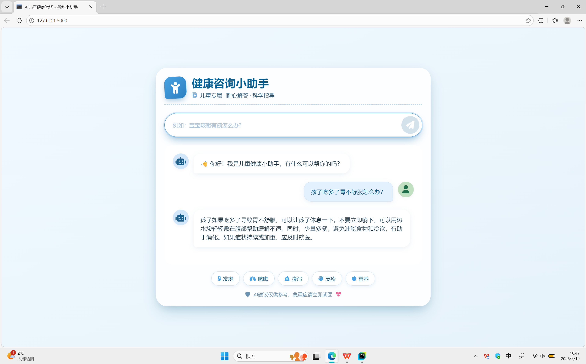

# 👶 儿童医疗助手 - Qwen 智能问答系统


[English](README.md) | [简体中文](./README.zh-CN.md) (如需中文版)

一个基于 **Qwen2.5-1.5B-Instruct** 模型的儿童医疗咨询助手，通过友好的对话界面，为家长提供专业的儿童健康建议。

## 📸 项目预览

>
>
> 

## ✨ 功能特性

- 🏥 **专业医疗助手**：基于 Qwen 大模型，专注于儿童健康问题
- 💬 **智能对话**：支持自然语言交互，理解家长的提问
- 🎯 **预设回答**：常见症状快速匹配，提高响应速度
- 🚀 **本地部署**：模型本地运行，保护隐私安全
- 🎨 **简洁界面**：基于 Flask 的 Web 界面，易于使用

## 🛠️ 技术栈

- **后端框架**：Flask
- **AI 模型**：Qwen2.5-1.5B-Instruct (通义千问)
- **深度学习**：PyTorch + Transformers
- **前端**：HTML + Jinja2 +vue3模板

## 📦 安装步骤

### 环境要求
- Python 3.8 或更高版本
- CUDA (可选，用于GPU加速)
- 至少 4GB 可用内存 (推荐 8GB)

### 1. 克隆项目
```bash
git clone https://github.com/aqiqiqiu/KidMed2026/tree/KidMed-Q2

```